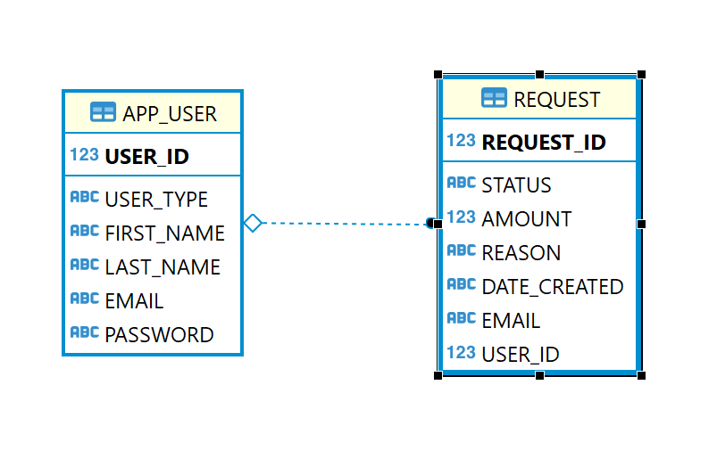

# Project 1

### Servlet classes:

ErsServlet- Processes GET requests for reimbursement request data.

LoginServlet- Processes POST requests to authenticate user credentials.

ModifyServlet- Processes POST requests to modify reimbursement request status.

RequestServlet- Processes POST request to create new reimbursement request.

UserServlet- Processes GET requests for user data.

### Service Classes:
RequestService- Accesses the RequestDaos for the servlet classes.

UserService- Accesses the UserDaos for the servlet classes.

### Dao Classes:
UserDaos- Accesses user data from the database

RequestDaos- Accesses reimbursement request data from the database.

### Model Classes:
User- This class holds user data.

Request- This class is used to hold reimbursement request data.

### Frontend:

Login- login.html and login.js

Home page- landing.html and landing.js

### Database:

